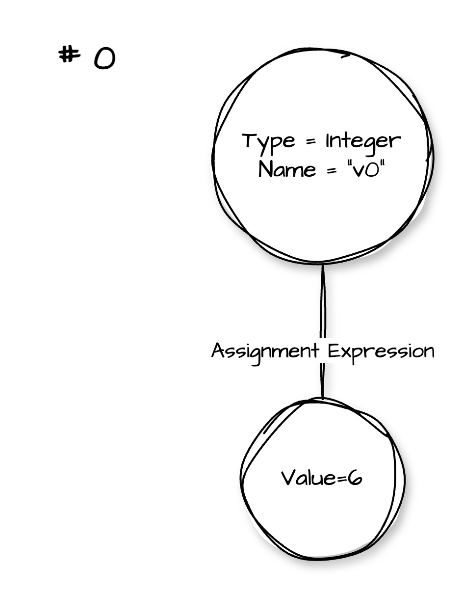
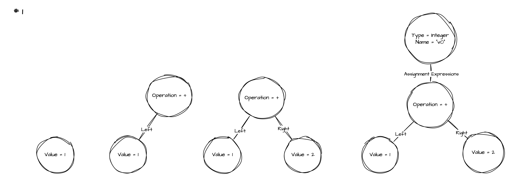
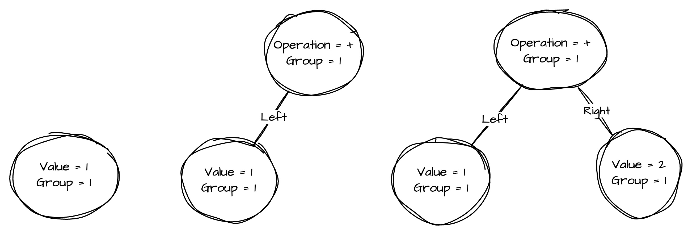
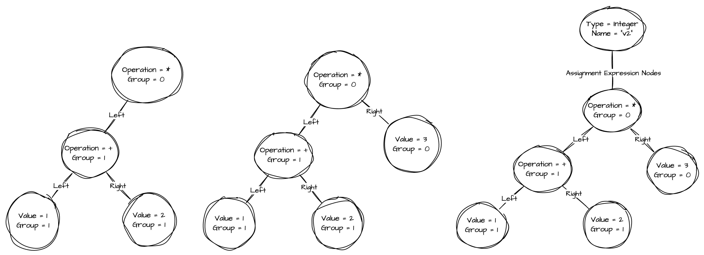
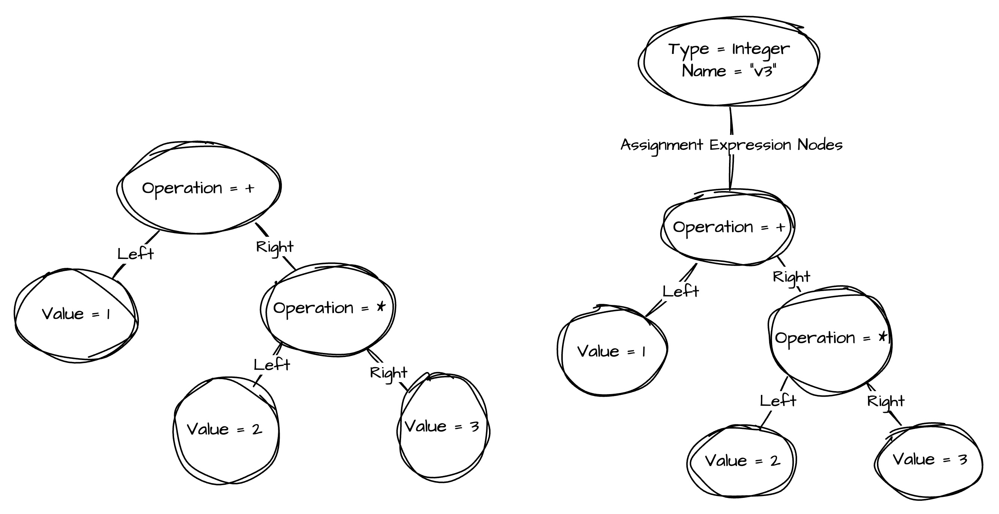
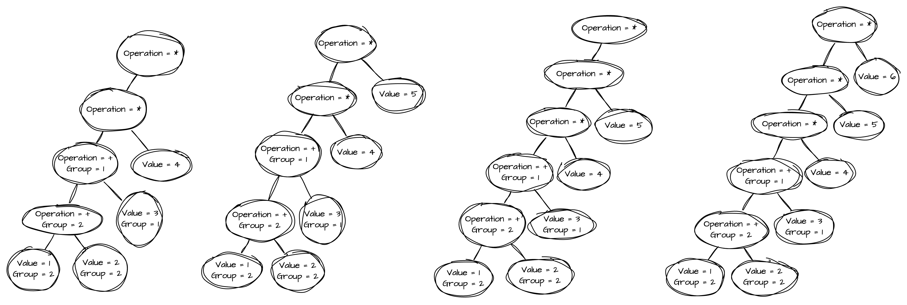
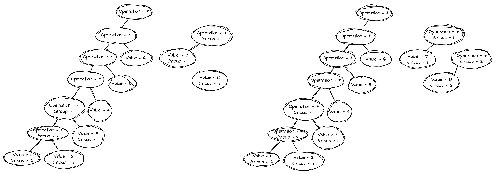
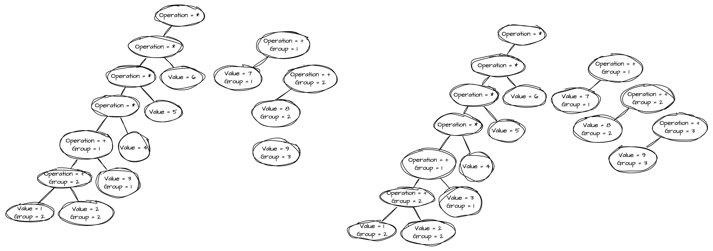
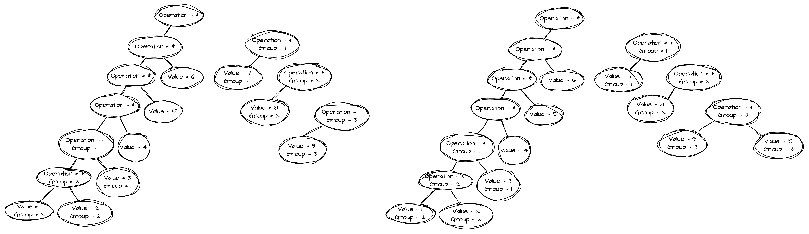

At this point I have the lexer (article drops soon) to parse the source code.
The next step is to create the parser and I started it with parsing variable assignment expressions.

In every modern language I know variable assignments are expressions.
This means that, on the right side of the assignment, after the `=` sign there is a code which will
be executed and the result assigned to the variable.
It is true even when the assignment looks like: `Integer intVar = 5;`

The evaluation of the expressions has to follow the precedence order from Math.
It means the following:

- evaluation goes from left to right
- `*` and `/` are evaluated before `+` and `-`
- whatever is placed in `()` will be evaluated first
- when there are nested parentheses the evaluation starts with the deepest one and comes out

The parsing is the process when these expressions will be represented as a tree, the more formal
name is the Abstract Syntax Tree. Later, the interpreter will go through this tree and execute
the instructions.

It seems to me the deeper something is represented in the tree it gets the higher precedence, so
I built my parser accordingly. When I am going to work on the interpreter (a tree-walking one)  
it will follow the rule that "if there is a `Pre/In/PostFixOperationNode` in either LEFT or
RIGHT side, evaluate first the LEFT and then the RIGHT. Meaning we go deep LEFT until we run out
of nodes representing operations. This is the representation of from LEFT to RIGHT, and what is
deeper in the tree it gets more priority (precedence). We will see how it works.

At this point PotatoLang's variable can't be a function and it cannot handle prefix and postfix
operations. These will come later.

The implementation is `C#` so it has some specifics to this. The language is statically
typed meaning types must be marked everywhere in the tree as I don't have type inferring yet.
Furthermore, in the AST a node can be a type which represents only a literal
value (`String`, `Integer`, `Boolean`), or it can represent an infix expression (`+, -, *, /`) or
pre/post-fix expression. For this reason the AST is interface based and every type of node
(literal value, infix or prefix) will have its own type. To go deeper in this please visit the repo
and knock yourself out with the types. As a result the implementation is heavy in type checks
and casting. During the explanation I'll mention the types and type checks.

The parser implementation is a recursive method which gets called by every character. The method
receives a pointer to the token needs to be processed. The characters in the code represented
by tokens provided by the parser (see article here). I skipped mentioning the error checks, but
we have some already and later more will be added.

Every example have picture attached showing how the AST is being built. The parser always gets
the list of tokens after the `=` sign.

As you may go through the code it will be clear instantly that we have to check a lot of things
at every token type. I mention only the involved checks relevant to actual case. If you want to
see all the checks, please take a look at the source code.

### Example 0

``` csharp
# 0
int v0 = 1;
```

Steps:

- `1` token:
    - the parser creates an `IntegerValueLiteral` type.
    - the parser calls itself with the newly created node and increases the pointer of processed
      token
- `;` token:
    - base case for the recursive call
    - every recursive call returns its results and the AST will get its final shape



### Example 1

``` csharp
# 1
int v1 = 1 + 2;
```

This is case doesn't have anything special. The processing will happen from the LEFT to the RIGHT.
The figure shows the steps who the tree is built.

Steps:

- `1` token:
    - the parser creates an `IntegerValueLiteral` type.
    - the parser calls itself and passes the newly created type, and increases the position
      pointer by 1
- `+` token:
    - the parser creates an `InfixOperationNode` type and marks the operation type
    - the parser checks if the input AST is `IntegerValueLiteral`, and adds it to the LEFT side
    - the parser calls itself and passes the `InfixOperationNode` (includes the previously created
      nodes), and increases the position pointer by 1
- `2` token:
    - the parser creates the `IntegerValueLiteral` type
    - the parser checks if the input AST is `InfixOperationNode`, and the `IntegerValueLiteral`
      type will be added to the LEFT side
    - the parser calls itself and passes the AST node, and increases the position pointer by 1
- `;` token:
    - base case for the recursive call
    - every recursive call returns its results and the AST will get its final shape



### Example 2

``` csharp
# 2
int v2 = (1 + 2) * 3;
```

This case includes a grouped expression (parentheses), meaning when the AST will be interpreted
the expression in the parentheses must be evaluated before the multiplication (`*`) operation.
The AST structure must mark this.

Steps:

- `(` token:
    - the grouping depth number will be increased
    - the parser calls itself and the passed AST type in this case is a `null`, and increases
      the position pointer by 1
- `1` token:
    - the parser creates an `IntegerValueLiteral` type.
    - the grouping depth is marked
    - the parser call itself and passes the newly created type, and increases the position
      pointer by 1
- `+` token:
    - the parser creates an `InfixOperationNode` type and marks the operation type
    - the parser checks if the input AST is `IntegerValueLiteral`, and adds it to the LEFT side
    - the parser calls itself and passes the `InfixOperationNode` (includes the previously created
      nodes), and increases the position pointer by 1
- `2` token:
    - the parser creates an `IntegerValueLiteral` type.
    - the grouping depth is marked
    - the parser call itself and passes the newly created type, and increases the position
      pointer by 1
- `)` token:
    - the parser decreases the grouping depth value
    - the parser returns the AST created so far and increases the position pointer by 1
- `*` token:
    - the parser creates an `InfixOperationNode` type and marks the operation
    - the checks the received AST, if it is a grouped expression then it adds to the LEFT side
    - the parser calls itself and passes the newly created AST node and increases the position
      pointer by 1
- `3` token:
    - the parser creates an `IntegerValueLiteral` type
    - the parser checks in the received AST node is an `InfixOperationType` or not, if so and
      its LEFT side is not null, then the newly created literal node will be added to the RIGHT side
    - the parser calls itself and passes the `InfixOperationType` node (the newly created
      integer value literal has been added to the RIGHT side), and increases the position
      pointer by 1
- `;` token:
    - base case for the recursive call
    - every recursive call returns its results and the AST will get its final shape

What worth note is what happens at the `*` token. The received AST is marked as grouped, meaning
its precedence trumps everything. The `*` token has to honor this even though it has a pretty
high precedence, at least higher than `+` operation has.





### Example 3

``` csharp
# 3
int v3 = 1 + 2 * 3;
```

This case shows how the parses behaves when there is an already processed expression, and it is
followed by a higher precedence expression. As the AST is built we have to ensure that the `*`
"steels" the `2` token and gets deeper in the AST.

- `1` token:
    - the parser creates an `IntegerValueLiteral` type.
    - the parser call itself and passes the newly created type, and increases the position
      pointer by 1
- `+` token:
    - the parser creates an `InfixOperationNode` type and marks what is the operation
    - when the input AST (passed by the previous call) is `IntegerLiteralValue` type it will be
      added to the LEFT side of the InfixOperationNode type
    - the parser calls itself and passes the `InfixOperationNode`, and increases the position
      pointer by 1
- `2` token:
    - the parser creates the `IntegerValueLiteral` type
    - they parser checks the input AST type and when it is `InfixOperationNode`, it checks if the
      LEFT side is not null, if not null the newly created LiteralType node will be added to the
      RIGHT side.
    - the parser calls itself and passes the InfixOperationNode node and increases the position
      pointer by 1
- `*` token:
    - the parser creates an `InfixOperationNode` type and marks the operation type
    - the parser checks the received AST and if it is not a grouped expression and its
      precedence is lower than the actual `InfixExpressionNode` then it takes the RIGHT side value
      of the `+` `InfixOperationNode` type and puts it on its own LEFT side,
      and puts itself to the `+` operation RIGHT side. By this the `*` `InfixOperationNode` gets
      deeper in the AST node, meaning it gets higher precedence (check the provided drawings!)
    - the parser calls itself and passes the AST, and increases the position pointer by 1
- `3` token:
    - the parser creates an `IntegerValueLiteral` type
    - the parser checks in the received AST node is an `InfixOperationType` or not, if so and
      its LEFT side is not null, then the newly created literal node will be added to the RIGHT side
    - the parser calls itself and passes the `InfixOperationType` node (the newly created
      integer value literal has been added to the RIGHT side), and increases the position
      pointer by 1
- `;` token:
    - base case for the recursive call
    - every recursive call returns its results and the AST will get its final shape




### Example 4

``` csharp
# 4
int v4 = ((1 + 2) + 3) * 4;
```

This case includes a nested grouped expressions (parentheses), meaning the AST has to represent
the order operations where `1 + 2` is interpreted first, then `+ 3` will be added and then the
result is multiplied by 4 (`* 4`).

Steps:

- `(` token:
    - the grouping depth number will be increased
    - the parser calls itself and the passed AST type in this case is a `null`, and increases
      the position pointer by 1
- `(` token:
    - the grouping depth number will be increased
    - the parser calls itself and the passed AST type in this case is a `null`, and increases
      the position pointer by 1
- `1` token:
    - the parser creates an `IntegerValueLiteral` type.
    - the grouping depth is marked
    - the parser call itself and passes the newly created type, and increases the position
      pointer by 1
- `+` token:
    - the parser creates an `InfixOperationNode` type and marks the operation type
    - the parser checks if the input AST is `IntegerValueLiteral`, and adds it to the LEFT side
    - the parser calls itself and passes the `InfixOperationNode` (includes the previously created
      nodes), and increases the position pointer by 1
- `2` token:
    - the parser creates an `IntegerValueLiteral` type.
    - the grouping depth is marked
    - the parser call itself and passes the newly created type, and increases the position
      pointer by 1
- `)` token:
    - the parser decreases the grouping depth value
    - the parser returns the AST created so far and increases the position pointer by 1
- `+` token:
    - the parser creates an `InfixOperationNode` type and marks the operation
    - the checks the received AST, if it is a grouped expression then it adds to the LEFT side
    - the parser calls itself and passes the newly created AST node and increases the position
      pointer by 1
- `3` token:
    - the parser creates an `IntegerValueLiteral` type
    - the parser checks in the received AST node is an `InfixOperationType` or not, if so and
      its LEFT side is not null, then the newly created literal node will be added to the RIGHT side
    - the parser calls itself and passes the `InfixOperationType` node (the newly created
      integer value literal has been added to the RIGHT side), and increases the position
      pointer by 1
- `)` token:
    - the parser decreases the grouping depth value
    - the parser returns the AST created so far and increases the position pointer by 1
- `*` token:
    - the parser creates an `InfixOperationNode` type and marks the operation
    - the checks the received AST, if it is a grouped expression then it adds to the LEFT side
    - the parser calls itself and passes the newly created AST node and increases the position
      pointer by 1
- `4` token:
    - the parser creates an `IntegerValueLiteral` type
    - the parser checks in the received AST node is an `InfixOperationType` or not, if so and
      its LEFT side is not null, then the newly created literal node will be added to the RIGHT side
    - the parser calls itself and passes the `InfixOperationType` node (the newly created
      integer value literal has been added to the RIGHT side), and increases the position
      pointer by 1
- `;` token:
    - base case for the recursive call
    - every recursive call returns its results and the AST will get its final shape


### Example 5

``` csharp
# 5
int v5 = ((1 + 2) + 3) * 4 * 5 * 6 * (7 + (8 + (9 + 10)));
```

Steps:

- `(` token:
    - the grouping depth number will be increased
    - the parser calls itself and the passed AST type in this case is a `null`, and increases
      the position pointer by 1
- `(` token:
    - the grouping depth number will be increased
    - the parser calls itself and the passed AST type in this case is a `null`, and increases
      the position pointer by 1
- `1` token:
    - the parser creates an `IntegerValueLiteral` type.
    - the grouping depth is marked
    - the parser call itself and passes the newly created type, and increases the position
      pointer by 1
- `+` token:
    - the parser creates an `InfixOperationNode` type and marks the operation type
    - the parser checks if the input AST is `IntegerValueLiteral`, and adds it to the LEFT side
    - the parser calls itself and passes the `InfixOperationNode` (includes the previously created
      nodes), and increases the position pointer by 1
- `2` token:
    - the parser creates an `IntegerValueLiteral` type.
    - the grouping depth is marked
    - the parser call itself and passes the newly created type, and increases the position
      pointer by 1
- `)` token:
    - the parser decreases the grouping depth value
    - the parser returns the AST created so far and increases the position pointer by 1
- `+` token:
    - the parser creates an `InfixOperationNode` type and marks the operation
    - the checks the received AST, if it is a grouped expression then it adds to the LEFT side
    - the parser calls itself and passes the newly created AST node and increases the position
      pointer by 1
- `3` token:
    - the parser creates an `IntegerValueLiteral` type
    - the parser checks in the received AST node is an `InfixOperationType` or not, if so and
      its LEFT side is not null, then the newly created literal node will be added to the RIGHT side
    - the parser calls itself and passes the `InfixOperationType` node (the newly created
      integer value literal has been added to the RIGHT side), and increases the position
      pointer by 1
- `)` token:
    - the parser decreases the grouping depth value
    - the parser returns the AST created so far and increases the position pointer by 1
- `*` token:
    - the parser creates an `InfixOperationNode` type and marks the operation
    - the checks the received AST, if it is a grouped expression then it adds to the LEFT side
    - the parser calls itself and passes the newly created AST node and increases the position
      pointer by 1
- `4` token:
    - the parser creates an `IntegerValueLiteral` type
    - the parser checks in the received AST node is an `InfixOperationType` or not, if so and
      its LEFT side is not null, then the newly created literal node will be added to the RIGHT side
    - the parser calls itself and passes the `InfixOperationType` node (the newly created
      integer value literal has been added to the RIGHT side), and increases the position
      pointer by 1
- `*` token:
    - the parser creates an `InfixOperationNode` type and marks the operation
    - the parser checks if the received AST is a grouped one or not, it is not, so the parser
      checks the previously added expression's precedence. It is equal to the actual one, so the
      "from left to right" rule applies, meaning the AST will be added to the LEFT side of the
      newly created `InfixOperationNode` type.
    - the parser calls itself and passes the newly `InfixOperationNode` which already have
      the AST created in previous iteration.
- `5` token:
    - the parser creates an `IntegerValueLiteral` type
    - the parser checks in the received AST node is an `InfixOperationType` or not. It is an
      `InfixOperationNode` and its left side is already occupied, so the newly created
      `IntegerValueLiteral` gets to the RIGHT side.
    - the parser calls itself and passes the `InfixOperationType` which already has the newly
      created `IntegerValueLiteral` node on the RIGHT side.
    - the position pointer will be increased by 1
- `*` token:
    - the parser creates an `InfixOperationNode` type and marks the operation
    - the parser checks if the received AST is a grouped one or not, it is not, so the parser
      checks the previously added expression's precedence. It is equal to the actual one, so the
      "from left to right" rule applies, meaning the AST will be added to the LEFT side of the
      newly created `InfixOperationNode` type.
    - the parser calls itself and passes the newly `InfixOperationNode` which already have
      the AST created in previous iteration.
    - the position pointer will be increased by 1
- `6` token:
    - the parser creates an `IntegerValueLiteral` type
    - the parser checks in the received AST node is an `InfixOperationType` or not. It is an
      `InfixOperationNode` and its left side is already occupied, so the newly created
      `IntegerValueLiteral` gets to the RIGHT side.
    - the parser calls itself and passes the `InfixOperationType` which already has the newly
      created `IntegerValueLiteral` node on the RIGHT side.
    - the position pointer will be increased by 1
- `*` token:
    - the parser creates an `InfixOperationNode` type and marks the operation
    - the parser checks what is the next token, it is `(`. The parser in this case does two things:
        - the received AST node will be added to the LEFT side of the newly created
          `InfixOperationNode` type
        - the parser kicks off a new parsing (it doesn't pass over any AST) to create the RIGHT
          side, meaning it calls itself and increase the position pointer by one and the returning
          result gets to the RIGHT side of the newly created `InfixOperationNode`.
    - the parser calls itself and passes the InfixOperationNode, and increases the position
      pointer by 1
- `(` token:
    - the parser has a grouping depth value representing grouped expressions, this value
      will be increased and added every AST type the parser creates
    - the parser calls itself and the passed AST type in this case is a `null`, and increases
      the position pointer by 1
- `7` token:
    - the parser creates an `IntegerValueLiteral` type
    - the parser checks in the received AST node is an `InfixOperationType` or not. It is an
      `InfixOperationNode` and its left side is already occupied, so the newly created
      `IntegerValueLiteral` gets to the RIGHT side.
    - the parser calls itself and passes the `InfixOperationType` which already has the newly
      created `IntegerValueLiteral` node on the RIGHT side.
    - the position pointer will be increased by 1
- `+` token:
    - the parser creates an `InfixOperationNode` type and marks the operation
    - the parser checks what is the next token, it is `(`. The parser in this case does two things:
        - the received AST node will be added to the LEFT side of the newly created
          `InfixOperationNode` type
        - the parser kicks off a new parsing (it doesn't pass over any AST) to create the RIGHT
          side, meaning it calls itself and increase the position pointer by one and the returning
          result gets to the RIGHT side of the newly created `InfixOperationNode`.
    - the parser calls itself and passes the InfixOperationNode, and increases the position
      pointer by 1
- `(` token:
    - the parser has a grouping depth value representing grouped expressions, this value
      will be increased and added every AST type the parser creates
    - the parser calls itself and the passed AST type in this case is a `null`, and increases
      the position pointer by 1
- `8` token:
    - the parser creates an `IntegerValueLiteral` type
    - the parser checks in the received AST node is an `InfixOperationType` or not. It is an
      `InfixOperationNode` and its left side is already occupied, so the newly created
      `IntegerValueLiteral` gets to the RIGHT side.
    - the parser calls itself and passes the `InfixOperationType` which already has the newly
      created `IntegerValueLiteral` node on the RIGHT side.
    - the position pointer will be increased by 1
- `+` token:
    - the parser creates an `InfixOperationNode` type and marks the operation
    - the parser checks what is the next token, it is `(`. The parser in this case does two things:
        - the received AST node will be added to the LEFT side of the newly created
          `InfixOperationNode` type
        - the parser kicks off a new parsing (it doesn't pass over any AST) to create the RIGHT
          side, meaning it calls itself and increase the position pointer by one and the returning
          result gets to the RIGHT side of the newly created `InfixOperationNode`.
    - the parser calls itself and passes the InfixOperationNode, and increases the position
      pointer by 1
- `(` token:
    - the parser has a grouping depth value representing grouped expressions, this value
      will be increased and added every AST type the parser creates
    - the parser calls itself and the passed AST type in this case is a `null`, and increases
      the position pointer by 1
- `9` token:
    - the parser creates an `IntegerValueLiteral` type
    - the parser checks in the received AST node is an `InfixOperationType` or not. It is an
      `InfixOperationNode` and its left side is already occupied, so the newly created
      `IntegerValueLiteral` gets to the RIGHT side.
    - the parser calls itself and passes the `InfixOperationType` which already has the newly
      created `IntegerValueLiteral` node on the RIGHT side.
    - the position pointer will be increased by 1
- `+` token:
    - the parser creates an `InfixOperationNode` type and marks what is the operation
    - when the input AST (passed by the previous call) is any LiteralValue type it will be added
      to the LEFT side of the InfixOperationNode type
    - grouping depth is marked
    - the parser calls itself and passes the InfixOperationNode, and increases the position
      pointer by 1
- `10` token:
    - the parser creates an `IntegerValueLiteral` type
    - the parser checks in the received AST node is an `InfixOperationType` or not. It is an
      `InfixOperationNode` and its left side is already occupied, so the newly created
      `IntegerValueLiteral` gets to the RIGHT side.
    - the parser calls itself and passes the `InfixOperationType` which already has the newly
      created `IntegerValueLiteral` node on the RIGHT side.
      pointer by 1
- `)` token:
    - the parser decreases the grouping depth value, meaning are one level higher in the nested
      grouping expressions
    - the return value of this operation will be added the `InfixOperationNode` representing the
      `+` operation after the `8` token. The parser is not aware of this, but if you go back to
      the `8` token I mentioned that the parser starts a new parsing session and the result will
      be added to the RIGHT side.
    - the parser returns the AST created so far and increases the position pointer by 1
- `)` token:
    - the parser decreases the grouping depth value, meaning are one level higher in the nested
      grouping expressions
    - the return value of this operation will be added the `InfixOperationNode` representing the
      `+` operation after the `7` token. The parser is not aware of this, but if you go back to
      the `7` token I mentioned that the parser starts a new parsing session and the result will
      be added to the RIGHT side.
    - the parser returns the AST created so far and increases the position pointer by 1
- `)` token:
    - the parser decreases the grouping depth value, meaning are one level higher in the nested
      grouping expressions
    - the return value of this operation will be added the `InfixOperationNode` representing the
      `*` operation after the `6` token. The parser is not aware of this, but if you go back to
      the `6` token I mentioned that the parser starts a new parsing session and the result will
      be added to the RIGHT side.
    - the parser returns the AST created so far and increases the position pointer by 1
- `;` token:
    - the parser returns the AST tree
    - this is the base case of the recursion and from this point the recursive calls are
      returning and the AST tree is going to be created
      











