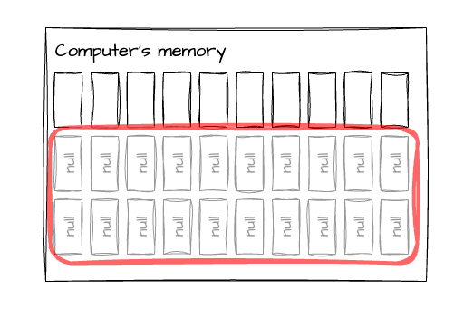
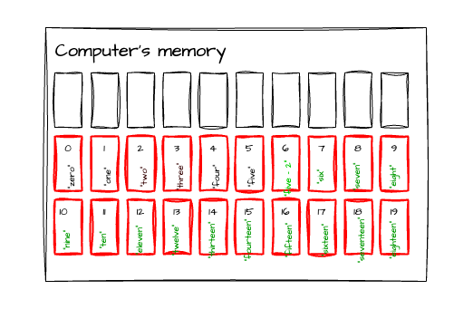
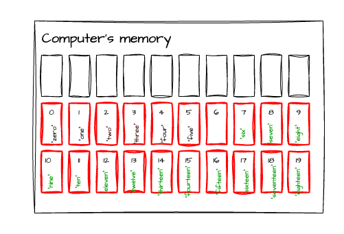

# Array

Array is a data structure to store something in the computer's memory and do
somethign to it. 
An array is like a list with some limitations and quirky things.
In computer science terminology the word array always refers to the data
structure will be described in this article.
There is the ArrayList which in its name very close to array.
As a matter of fact it is close in its behaviour too, but there are significant
differences between the two.
There is an article about ArrayList.


The picture above shows a simplified version of the computer's memory. The
single memory addresses are marked as boxes.

An array represents a contiguous space in the computer's memory.
In practice, it means the elements of the array are placed next to each other in
the computer's memory.
When the code `new [10]` will be executed the language runtime claims its need
for a certain amount contiguous memory.

An array is always fixed size, and its size has to be provided at initialization.
The values of the array are set to default (it depends on the language).

An array always zero indexed, meaning the first element is always under the
index 0.



# Operations and their complexities

| Operation | Big O notation    |
|-----------|-------------------|
| Add       | `O(1)` - constant |
| Insert    | `O(N)` - linear   |
| Search    | `O(N)` - linear   |
| Delete    | `O(1)` - constant |

---
**Note**

Some computer science lingo clarification comes here:

`Adding`, in general, means adding a new element to a list/array as last item. This is also called as append.
While `insert` means the item will be added to the designated index and all item right to it will be
shifted right.
---

## Adding elements

In reality there is no such thing adding an element to an array.
Moreover, there is no `append` or similar operation on an array in, for
example, java.

The add operation, in reality, overwrites the value at the designated place.
The index marking in which position the given element will be added has to be
always provided like in the example below (java):

```java
// initialization of the array
strin[] string_array = new[20];
// adding value 14 to the index 3 place in the array
string_array[3] = "asd";
string_array[4] = "foo";
string_array[15] = "bar";
```
The code above results what is displayed in the screenshot below.
Pay attention to the zero indexing.


Based on the above we can say that the time complexity of adding an element to an array is 
always the same: **constant**.

## Insert

The insert operation has 3 versions:

- insert as first element and everything shifts right
- insert somewhere in the middle and everything right to it shifts right
- insert as last element and nothing gets shifted

An insert operation consists of two distinct operations:

- take the values after the designated index and shift them right
- insert the value to the place

Having the two operations above we can insert a new element into an array.

The insert operation due to fixed nature of the arrays is a risky one.
It may cause data loss or unwanted exceptions.

The other problem comes with `insert` is that shifting the original array elements requires
another array and by that increasing the space complexity.

The two screenshots picture an insert operations where the `"five-2"` value will be inserted
into the `6th` index and everything after this index will be pushed right.
Since the array is already full there is no place for the last item to be shifted to.
It is either a silent data loss or some type of error message from the language runtime.


As a summary, we can say that in worst case the `insert` operation requires going through the
array once.
In order to shift the array elements another array is needed with the same size as the
original array, in worst case.
As a conclusion, the time complexity of the `insert` operation is **linear** in worst case.
The space complexity is also **linear**.

## Searching for an element

Finding an element in the array means that every item in the array needs to be checked
if fits for the search criteria.
In general, it requires a `for` or `foreach` loop or something similar from the fancy
lamba functions.
But, the fact is that in worst case every element has to be checked.
It means that the time complexity of the search operation is **linear** while the space
complexity is **constant**.

---
**Note**

Some computer science lingo clarification here:

There is no similarly distinct meaning difference between `delete` and `remove` as it was
pointed out in the case of `insert` and `add`, but making some difference still needed.

`Remove`s meaning includes that the place where the value was stored also gone meaning
all the elements right to it will be shifted to the left.
`Delete` does not have an extra meaning like this.
The value is deleted, but its container not.

---

## Delete an element

In reality, there is no such thing to remove an element from an array.
The `delete` operation sets the value at the designated index to array default, which in
many cases `null`.
The screenshots show this process.



```java
string[] string_array = new[20];
string_array[6] = null;
```



## Remove an element

The remove operation is similar to `Insert`. It also has 3 variations:

- Remove an element from the first place and shift left everything after the deleted element
- Remove an element from the middle and shift left everything after the element
- Remove an item from the last position, here there is no shift only adding default value

# C# implementation

# Java implementation
